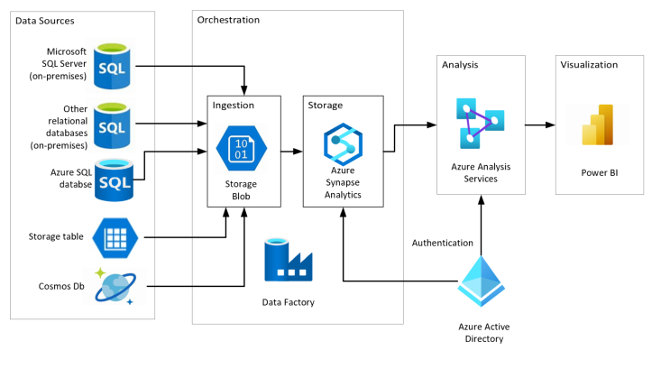

# azure_data_storage
Script para conectar SQL Server on premise a um Azure Data Storage

# Objetivo 
Com esse script e possivel criar uma integração entre o azure data storage, como funciona o synape.
Será possivel criar external tables possibilitando a utilização no banco relacional.
  

  
  

 

# Problemas encontrados 
Alguns tipos de dados não são encontrados como numeric(x,x), varcharing() principalmente de arquivos parquet 
